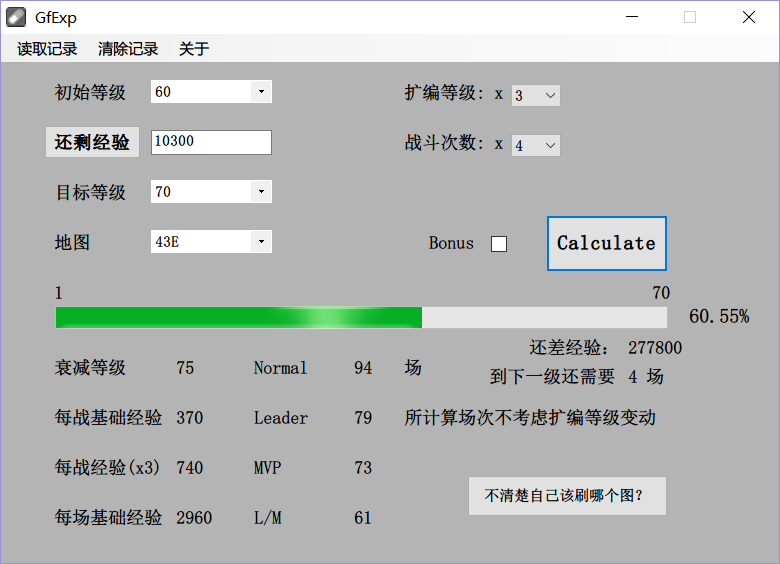

# README

---

## An easy calculator for Girls Frontline Exp

因为觉得[jyying.cn](http://jyying.cn/snqxap/calclevel.html)的计算器不是很适合自己的使用，所以自己写了个类似的计算器。

一方面是扩编等级有的时候跟理想情况有偏差，另一方面是有时候一些地图的战斗次数比较固定，想直接了解需要战斗的场数，也许这样计算之后会方便一点。

最后就是以后会加入一点更新的内容，包括自动更新、加入NEXT经验替代已有经验的计算方式等。
